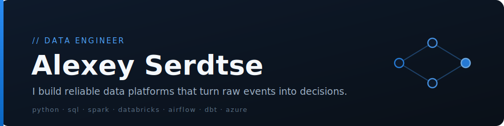

 

 

  

## 🚀 About Me

- 🔧 I design and build **data pipelines** end to end — ingestion, transformation, and orchestration at scale.
- ⚡ I work the modern data stack: **Spark / Databricks**, **Airflow**, and **dbt**.
- 🐍 My daily drivers are **Python** and **SQL**.
- 📊 I care about clean schemas, idempotent jobs, and platforms that stay quiet at 3 a.m.
- 🌱 ~7 years across the data stack — started in data analysis, grew into data engineering.

## 🛠️ Tech Stack

## 💼 Experience

**Data Engineer** · NAYA Technologies (part of EPAM Systems) — Israel

Building pipelines and lakehouse platforms on Spark, Databricks, Airflow, and dbt. <!-- placeholder: add dates + 3–5 impact bullets (scale, cost/runtime saved, SLAs) -->

#### Certifications

- Associate Data Engineer — DataCamp (2025)
- SQL Server Developer — DataCamp (2021)
- BI Developer — Technion (2019)

## 📌 Featured Project

**[UdemyFormula1](https://github.com/alexeyserdtse/UdemyFormula1)** — an Azure Databricks + Spark pipeline that ingests Formula 1 race data and models it through a bronze → silver → gold lakehouse architecture.

## 📊 GitHub Stats

<picture>
  <source media="(prefers-color-scheme: dark)" srcset="https://raw.githubusercontent.com/alexeyserdtse/alexeyserdtse/output/github-contribution-grid-snake-dark.svg"/>
  <source media="(prefers-color-scheme: light)" srcset="https://raw.githubusercontent.com/alexeyserdtse/alexeyserdtse/output/github-contribution-grid-snake.svg"/>
  
</picture>

  

