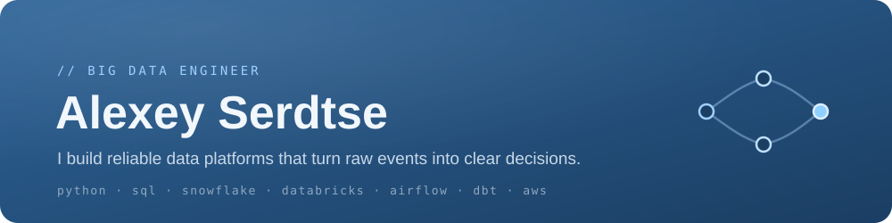
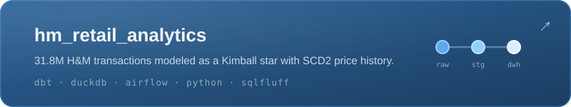

<picture>
  <source media="(prefers-color-scheme: light)" srcset="./assets/hero-light.svg"/>
  
</picture>

 

 

## 🚀 About Me

- 🛠️ **Big Data Engineer** at NAYA Technologies (part of EPAM) — I build data pipelines and lakehouse platforms end to end.
- ⚡ Core stack: **Snowflake**, **Databricks**, **Spark**, **Airflow**, and **dbt**, on an **AWS** data lake (**S3**).
- 🐍 Primary languages **Python** (including **PySpark**) and **SQL**, applied across ingestion, orchestration, transformation, and query optimization.
- 📊 Focused on clean schemas, idempotent jobs, and reliable, well-monitored pipelines.
- 🌱 ~7 years across the data stack — started in data analysis, grew into data engineering.
- 📍 Based in Israel.

## 💼 Experience

**Big Data Engineer** · NAYA Technologies (part of EPAM) — Israel · Feb 2026 – Present

Building data solutions on **Databricks** and **AWS**.

**Data Engineer** · NICE Ltd (via Outstaff) — Ra'anana, Israel · Sep 2022 – Feb 2026

Part of a 6-person team running a **130 TB** Snowflake warehouse — joined as the SSIS specialist and grew into Snowflake administration, cross-team coordination, and mentorship.

- Built and owned dozens of ingestion pipelines from APIs, S3, SharePoint, and internal/external databases.
- Rewrote a dbt analytics pipeline, cutting runtime from **30 min to 6**.
- Built reusable Python classes and Airflow patterns adopted across the team; managed Fivetran connectors.
- Owned Snowflake administration & governance — roles, access, and production deployments; used Snowflake Cortex to fix query bottlenecks.
- Led the on-prem → cloud migration: ran the AWS-vs-Azure POC, audited hundreds of data processes, and drove phased waves through post-migration validation.

### Certifications

- Associate Data Engineer — DataCamp (2025)
- SQL Server Developer — DataCamp (2021)
- BI Developer — Technion (2019)

## 🛠️ Tech Stack

&emsp;
&emsp;
&emsp;
&emsp;
&emsp;
&emsp;
&emsp;
&emsp;

## 📌 Featured Project

  <a href="https://github.com/alexeyserdtse/hm_retail_analytics">
    <picture>
      <source media="(prefers-color-scheme: light)" srcset="./assets/project-card-light.svg"/>
      
    </picture>
  </a>

## 📊 GitHub Stats

  <picture>
    <source media="(prefers-color-scheme: light)" srcset="https://streak-stats.demolab.com/?user=alexeyserdtse&hide_border=true&border_radius=18&background=F8FBFE&stroke=C7D8E8&ring=2E6498&fire=2A8BF2&currStreakNum=1B3E63&sideNums=1B3E63&currStreakLabel=2E6498&sideLabels=2E6498&dates=8FA8C0&cache_bust=20260726"/>
    
  </picture>

  

